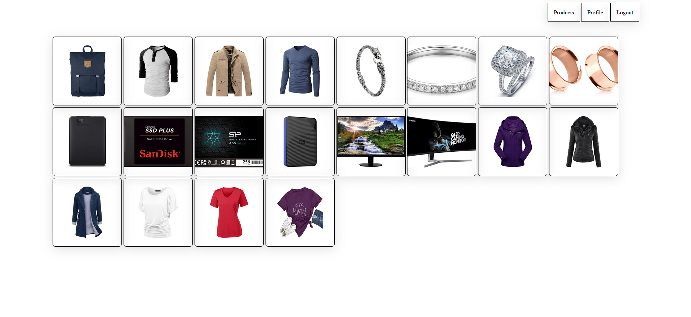

# WebShop project

## Project Description

Testing out Java Spring Boot as API backend for a simple ecommerce webshop where frontend is written in react.

### Tech Stack:

- **Frontend**: React
- **Backend**: Java Spring Boot Maven
- **Database**: PostgreSQL

## Table of Contents

- [How to Run the Project](#how-to-run-the-project)
  - [Run Locally](#run-locally)
- [Screenshots](#screenshots)
- [Usage](#usage)
- [Contributing](#contributing)
- [License](#license)
- [Contact](#contact)

## How to Run the Project

### Live Version

Uploading live product to here: [LIVE](https://www.devpipe.ee)

### Run Locally

To run the project locally, follow these steps:

#### Prerequisites

- Java installed
- Node.js and npm installed
- Docker installed

#### Steps

1. **Clone the repository**:

   ```bash
   git clone https://github.com/The-Estonian/WebShop
   cd WebShop
   ```

2. **Run the backend**:

   - Open the first terminal

   ```bash
   cd backend
   java spring-boot:run
   ```

3. **Run the frontend**:

   - Open the second terminal

   ```bash
   cd frontend
   npm install
   npm run dev
   ```

4. **Fill the DB**:

   - Open the third terminal

   ```bash
    cd PostgreSQL

    # This will download and run PostgreSQL DB in Docker
    run the build.bat script

    # This will run a python script to pull dummy items from internet and push them into the PostgreSQL DB
    run the bootstreapDB.py
   ```

Note:

## Screenshots

Here's screenshots of the project:



## Usage

After running the project locally, you should be initially see the products in react that are forwarded via Java Spring boot to react.

## Contributing

We welcome contributions! Please contact one of the authors in discord if you would like to contribute to future projects.

## License

This project is licensed under the MIT License. See the [LICENSE](https://opensource.org/license/mit) file for details.

## Contact

For any questions or suggestions, feel free to contact us directly at `Kood / Jõhvi Discord`.

## Nota Bene

The project is still a work in progress, has some bugs and could also hold more simple games in the future with some new minor bugs.

_Authors: [Jaanus Saar](https://01.kood.tech/git/jsaar)_

```

```
